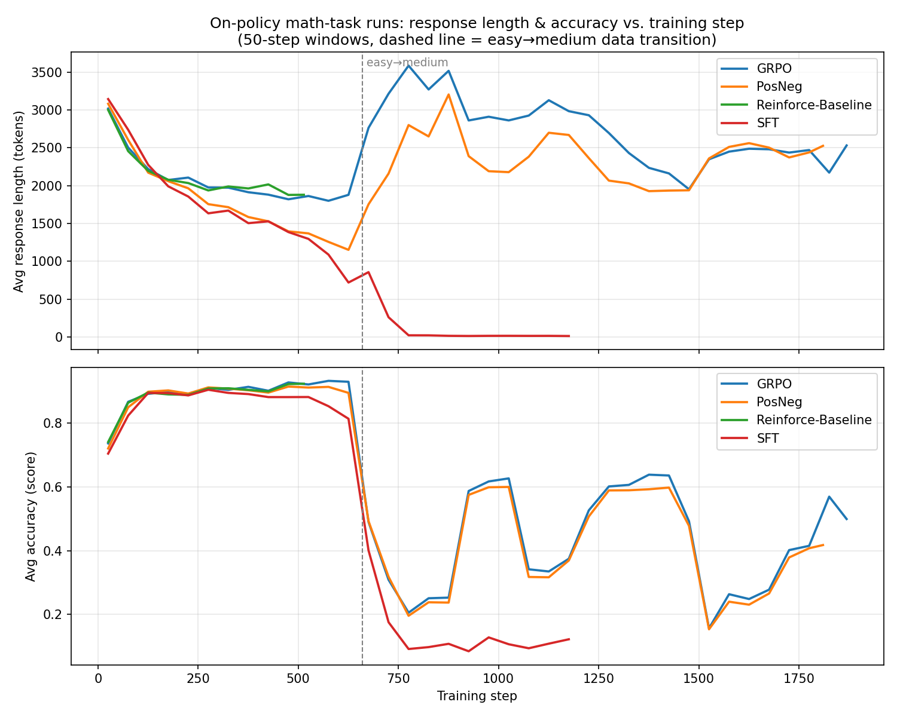
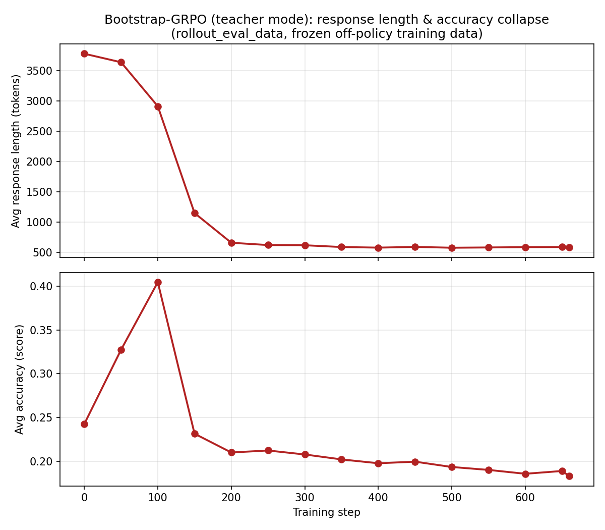

# Response Length Dynamics in Math-Task Qwen3-1.7B Training Runs

**Date:** 2026-07-06
**Context:** Investigating why response length oscillates ("goes up and down") during on-policy GRPO training on `data/math` (easy+medium), and why response length collapses permanently in the Bootstrap-GRPO and positive-only SFT runs. Runs analyzed live in `/data/user_data/gyeongwk/checkpoints/math-task/`:

- `math-onpolicy-GRPO-Qwen3-1.7B`
- `math-onpolicy-PosNeg-Qwen3-1.7B`
- `math-onpolicy-Reinforce-Baseline-Qwen3-1.7B`
- `math-onpolicy-SFT-Qwen3-1.7B`
- `math-bootstrap-GRPO-easy-Qwen3-1.7B`

All configs use `MAX_GEN_LENGTH=4096`, `ROLLOUT_N=16`, `train_batch_size=16` (256 samples/step), `data.shuffle=False`, `total_epochs=1`, training sequentially through `math-easy` (10,560 rows → steps 1–660) then `math-medium` (22,252 rows → steps 661+), except the bootstrap run which trains only on a frozen, pre-generated `math-easy` pool.

**Reproducing this analysis:** every table, number, and plot below is generated directly from the raw `rollout_data`/`rollout_eval_data` JSONL files by a single script:

```bash
python scripts/analysis/math_task_length_dynamics_analysis.py \
    --checkpoints-dir /data/user_data/gyeongwk/checkpoints/math-task \
    --output-dir reports/figures
```

It re-parses all rollout files from scratch (no cached intermediate data), so it is slow (~5–10 minutes, I/O-bound across thousands of small files) but fully reproducible. It prints every table in this report to stdout, saves per-step CSV caches (`reports/figures/step_stats_*.csv`) for quick re-plotting, and regenerates the two PNGs embedded below.

---

## 1. On-policy GRPO: the sawtooth pattern is dataset-driven, not instability



*GRPO and PosNeg track each other almost step-for-step (same unshuffled data order); Reinforce-Baseline overlaps them exactly before its run stopped at step ~527; SFT (positive-only) is indistinguishable from the others through the easy phase, then collapses permanently right at the easy→medium boundary instead of rebounding.*

Aggregating `response_lengths`/`score` from every `rollout_data/*.jsonl` file (50-step windows):

| Steps | Avg length | Avg accuracy | Note |
|---|---|---|---|
| 1–50 | 3017 | 0.736 | start of easy phase |
| 601–650 | 1877 | 0.929 | easy phase converged |
| 651–700 | 2763 | 0.490 | **easy→medium boundary (step 660)** |
| 751–800 | 3584 | 0.206 | deepest point of first crash |
| 951–1000 | 2909 | 0.617 | recovery |
| 1501–1550 | 2347 | 0.157 | second crash |
| 1851–1887 | 2530 | 0.499 | recovery by end of run |

- Steps 1–660 (`math-easy`): length falls smoothly while accuracy rises — genuine convergence, the model gets faster and more confident on mastered problems.
- Step ~660: data stream crosses into `math-medium` (verified against row counts: 10,560/16=660). Length jumps back up, accuracy craters.
- Steps 700–1887: a recurring boom/bust cycle as the *unshuffled* stream moves through different difficulty/subject pockets of `math-medium`.
- **Confirmed data-driven, not algorithm-specific**: `math-onpolicy-PosNeg-Qwen3-1.7B` (same data order) shows the same crash/recover timing almost step-for-step (crash ~660–900, recover ~1000, crash ~1500–1550, recover ~1850).
- A per-batch correlation between the dataset's own precomputed per-problem `length` stat (present in `math-easy/train.parquet`, itself derived from base-model bootstrap rollouts) and the empirical rollout length in that batch: **r ≈ 0.30** — supports that batch composition partly explains within-batch variance.

What keeps this a *sawtooth* rather than a permanent collapse: `enable_negative_sample_training=True` for GRPO/PosNeg/Reinforce-Baseline means every step resamples fresh from the current policy and explicitly penalizes wrong rollouts — regressions on harder data get corrected live.

---

## 2. Does the length increase come from negative samples being shorter than positive ones?

**No — checked directly, and it's the opposite.** Pooling all samples by correctness per step, incorrect (negative) samples are *consistently longer* than correct (positive) ones at every point in training, including during the crashes:

| Steps | pos_len | neg_len | gap (pos−neg) |
|---|---|---|---|
| 1–50 | 2662 | 4054 | −1392 |
| 601–650 | 1772 | 3321 | −1549 |
| 651–700 (crash begins) | 2301 | 3315 | −1014 |
| 751–800 (deepest crash) | 2900 | 3767 | −867 |
| 1501–1550 (2nd crash) | 2098 | 2429 | −331 |
| 1851–1887 | 2009 | 3054 | −1045 |

The gap never flips sign — the within-batch training signal (reinforce short-correct, penalize long-incorrect) pushes toward brevity throughout, including during crashes. Part of this gap is mechanical: sampling across the run, **40.6% of incorrect samples hit the 4096-token max-length cap** (truncated, unfinished) vs only **7.4%** of correct ones.

What actually drives the length increase at the crash points: both `pos_len` and `neg_len` rise together at the easy→medium transition — harder problems cost more tokens whether the model gets them right or wrong (a pure task-complexity/data-composition effect). The pos/neg *gap* narrows in harder regions (−1500 → −400/−900) but never reverses.

---

## 3. Revisiting the mechanism: per-prompt-group (GRPO unit) analysis

GRPO's advantage is computed **per prompt-group** (16 same-prompt rollouts sharing `rollout.n=16`), confirmed by checking that consecutive 16-row blocks in `rollout_data/*.jsonl` share the same `input`. Re-running the correct-vs-incorrect comparison at the group level:

### 3a. Group outcome composition

| Phase | all-correct groups | all-incorrect groups | mixed groups |
|---|---|---|---|
| easy (100–300) | 1979 | 18 | 1219 |
| crash (700–900) | 257 | 1728 | 1231 |

All-correct and all-incorrect groups both carry **zero GRPO gradient** (reward is constant within the group ⇒ `reward − group_mean = 0`). Note the count of *mixed* (gradient-contributing) groups is nearly identical between phases (1219 vs 1231) — so "less training signal overall" is not the right explanation; what shifts is the **composition inside** the mixed groups.

### 3b. Success-rate composition within mixed groups

| Phase | low-success (1–4/16 correct) | mid (5–11/16) | high-success (12–15/16) |
|---|---|---|---|
| easy (100–300) | 6.1% | 26.2% | 67.8% |
| crash (700–900) | 37.0% | 35.3% | 27.8% |

In the easy phase, mixed groups are overwhelmingly "almost everything right, rare miss." In the crash phase this flips to "almost everything wrong, rare success."

### 3c. Correct-sample length by success-rate bucket

| Phase | low-success bucket avg correct len | mid bucket | high-success bucket |
|---|---|---|---|
| easy (100–300) | 3320 | 3166 | 2582 |
| crash (700–900) | 3564 | 3254 | 2735 |

Within either phase, correct length *increases* as success gets rarer — solving a problem for real, when mostly failing it, tends to take more tokens than solving one already mastered.

### 3d. Why this matters: std-normalized advantage amplifies rare successes

GRPO uses `reward_baseline="mean"` + `reward_normalize_std=True`. For a group with success rate `p`, a correct sample's advantage is `(1−p)/std(p)` where `std(p)=sqrt(p(1−p))` — this **grows as `p→0`** (a lone correct rollout in an otherwise-failing group gets an outsized per-sample gradient). Combined with 3c (rare successes are also the longest), the model's updates in the hard-data regime are increasingly built from "reinforce this one long trajectory that worked":

| Phase | plain (unweighted) avg correct length | GRPO-advantage-weighted avg correct length |
|---|---|---|
| easy (100–300) | 2702 | 2881 |
| crash (700–900) | 3018 | 3258 |

The advantage-weighting gap over the plain average (179 → 240 tokens) grows in the crash regime — quantifying a real, mechanistic force toward longer generations. It is **not** EOS suppression via the incorrect-sample gradient (that force still points toward brevity, section 2); it is the correct-sample gradient becoming concentrated on longer trajectories as group success rates drop.

---

## 4. Bootstrap-GRPO: permanent collapse, different mechanism entirely



`trainer.data_source.mode=teacher` (`recipe/osft/data_source_controller.py`) makes this run fundamentally different from the on-policy runs: it loads a **static pool of 16 rollouts per problem, pre-generated once by the untrained base model** (`experiments/math/qwen3-1.7b/generate_bootstrap.sh`), and trains a plain weighted-NLL loss against that frozen data for exactly one pass (660 steps, easy-only, never resampled). Verified in code: `needs_rollout_generation()` returns `False` throughout, and `_build_teacher_training_batch` (`osft_trainer.py`) tokenizes the pre-stored `responses` column directly — `actor_rollout_wg.generate_sequences` is never called during training.

Rollout-eval trajectory (`rollout_eval_data/*.jsonl`):

| Step | Avg length | Avg accuracy |
|---|---|---|
| 0 | 3775 | 0.243 |
| 50 | 3635 | 0.327 |
| 100 | 2910 | 0.405 (peak) |
| 150 | 1151 | 0.231 |
| 200 | 663 | 0.210 |
| 300–660 | ~580–620 | ~0.19–0.21 (stuck plateau, never recovers) |

The `<think>` block itself collapses from full genuine derivations at step 100 to literally `<think>\n\n</think>` by step 150–660.

**Why it's permanent:** the frozen bootstrap parquet has `correct_length` averaging ~3250 tokens vs `incorrect_length` ~3705 (75th-percentile `incorrect_length` pinned at the 8192-token generation cap — most "incorrect" samples there are truncated/ran-out-of-budget, not short-and-wrong). Since GRPO advantage weighting applies uniform positive weight to every correct sample and uniform negative weight to every incorrect sample regardless of length, every step systematically reinforces brevity. Because the data is frozen (no resampling from the drifting current policy) and there's no medium-difficulty data mixed in to demand longer reasoning, nothing ever pushes back — unlike on-policy GRPO's live resample-and-penalize loop (section 1), which corrects itself every step.

---

## 5. SFT (positive-only): a different, equally permanent collapse

`enable_negative_sample_training=False` — only correct rollouts are ever reinforced; nothing is penalized.

| Steps | Avg length | Avg accuracy |
|---|---|---|
| 1–50 | 3143 | 0.704 |
| 601–650 | 719 | 0.813 |
| 651–700 (easy→medium boundary) | 856 | 0.401 |
| 701–750 | 260 | 0.176 |
| 751–1200 | ~12–21 | ~0.08–0.13 (stuck, never recovers) |

Through the easy phase it converges identically to GRPO/PosNeg. But exactly at the easy→medium boundary (~step 660), where GRPO/PosNeg *rebound*, SFT keeps collapsing instead. Sample output at step ≥1190: `</think>\n\n\boxed{9340}` — a bare guessed number, no reasoning at all, nearly identical across all 16 samples for the same prompt (entropy collapse).

**Mechanism:** without any negative gradient, only self-reinforcing successes drive the update (unregularized rejection-sampling self-distillation, STaR-like). As the model got increasingly confident/brief on easy problems, that brevity kept being reinforced. When it then hit unfamiliar/harder medium problems where the short-guess habit stopped working, there was no corrective signal telling the model "this was wrong, reason more" — so the shortcut habit overrode reasoning permanently.

---

## 6. Reinforce-Baseline

Job stopped at step ~527 (checkpoint saved at step 500), never reaching the medium split. Trajectory in that window is essentially identical to GRPO/PosNeg's easy-phase convergence (3000→1878 tokens, 0.74→0.92 accuracy). Spot-checked step 520: the falling average reflects genuine efficiency, not degeneration — ~91% of rollouts are short (500–1500 tok) and mostly correct, while ~9% (genuinely hard residual problems) still hit the 4096 cap and are mostly wrong. No evidence of collapse — the run simply didn't reach the medium data before stopping.

---

## 7. Cross-run summary

| Run | Negative-sample gradient? | Data source | Length collapse? | Recovers? |
|---|---|---|---|---|
| On-policy GRPO | Yes | Live, resampled every step | Sawtooth with data difficulty, no permanent collapse | Yes, every crash |
| On-policy PosNeg | Yes | Live, resampled every step | Same sawtooth timing as GRPO | Yes |
| Reinforce-Baseline | Yes | Live, resampled every step | None observed (stopped in easy phase) | N/A |
| On-policy SFT | **No** | Live, resampled every step | **Yes — permanent**, triggered at easy→medium boundary | No |
| Bootstrap-GRPO | Yes (but on frozen data) | **Static, pre-generated once, never resampled** | **Yes — permanent**, within ~200 steps | No |

**Takeaway:** the on-policy runs' length oscillation tracks the unshuffled dataset's difficulty structure and is actively held in check by two forces that both depend on live resampling: (a) a persistent per-sample bias toward reinforcing shorter correct completions over longer incorrect ones, which never reverses sign, and (b) as harder data pushes group success rates down, the *correct*-sample gradient (not the incorrect one) becomes disproportionately concentrated — via GRPO's std-normalized advantage — on the rare, longer trajectories that actually solve hard problems, which is the real mechanistic force behind the length increases in the medium-difficulty regime. Bootstrap-GRPO and SFT both collapse permanently because they each break one dependency of that self-correcting loop — bootstrap by freezing the rollout data entirely, SFT by never applying negative feedback — and in both cases the result converges to the same signature: an emptied-out `<think>` block, response length near zero, and a stuck low-accuracy plateau.
