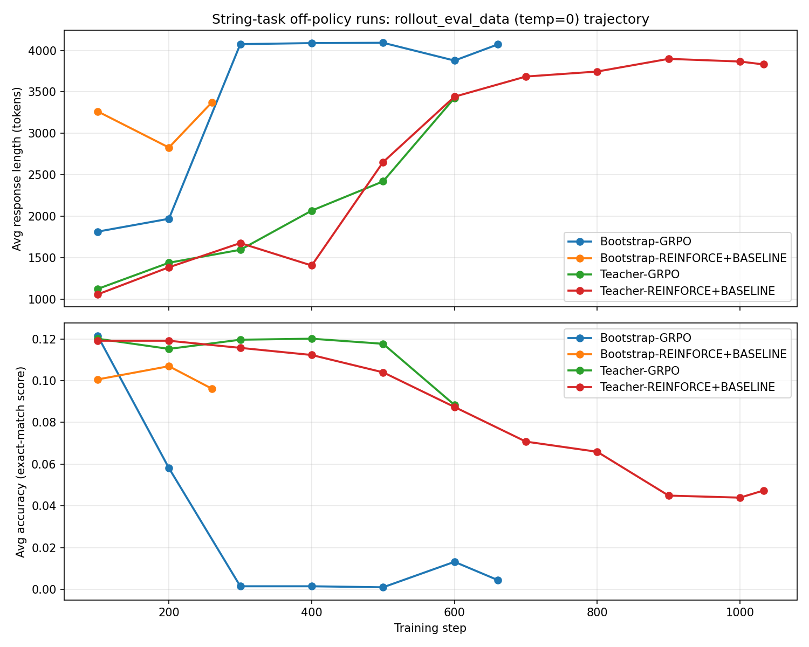

# Model Collapse in String-Task Off-Policy (Bootstrap/Teacher) Runs

**Date:** 2026-07-07
**Context:** Investigating why every string-task run trained on frozen off-policy
data (Bootstrap or Teacher source) with a negative-sample loss (POS+NEG,
REINFORCE+BASELINE, GRPO) ends up *worse than the starting model* — what the
generations look like throughout training, and what mechanism drives it.

Runs analyzed, all live in `/data/user_data/gyeongwk/checkpoints/string-task/`:

- `Bootstrap-GRPO`
- `Bootstrap-REINFORCE+BASELINE`
- `Teacher-GRPO`
- `Teacher-REINFORCE+BASELINE`

`Bootstrap-POS+NEG` and `Teacher-POS+NEG` were never checkpointed (no
`rollout_eval_data`/`rollout_data` on disk) — not analyzed here.

**Reproducing this analysis:**

```bash
python scripts/analysis/string_task_collapse_analysis.py \
    --checkpoints-dir /data/user_data/gyeongwk/checkpoints/string-task \
    --output-dir reports/figures
```

It re-parses `rollout_eval_data/*.jsonl` for the trajectory tables/plot, dumps
example generations to `reports/figures/string_task_examples/`, and directly
re-scores the two frozen training pools (`data/string_task/teacher-bootstrap/`
and `data/string_task/teacher-grpo/rollout.parquet`) using the same
extraction/matching logic as `verl/utils/reward_score/codeio.py`, tokenized
with the real training tokenizer (`gyeongwk/stage1-rft`).

---

## 1. Setup: "Bootstrap" and "Teacher" are the same mechanism, different frozen pools

Despite the different experiment-folder names, both families use
`trainer.data_source.mode=Teacher` in `recipe/osft/data_source_controller.py`:
a pool of 16 pre-generated rollouts per prompt is loaded once and cycled
through repeatedly (`_teacher_idx` wraps modulo pool size) — **no live
resampling from the current policy, ever**. The only difference is which
frozen pool:

| Family | Frozen pool | Pool origin |
|---|---|---|
| Bootstrap | `data/string_task/teacher-bootstrap/rollout.parquet` | Rollouts from the **untrained base** `stage1-rft` model |
| Teacher | `data/string_task/teacher-grpo/rollout.parquet` | Rollouts **distilled from an RL-trained teacher checkpoint** |

The loss functions differ only in how `recipe/osft/osft_sample_selection.py`
weights each (frozen) rollout:

| Loss | `reward_baseline` | `reward_normalize_std` | Per-sample weight |
|---|---|---|---|
| POS+NEG | `none` | — | `+1` correct / `-1` incorrect, only for prompts with ≥1 correct |
| REINFORCE+BASELINE | `mean` | `False` | `reward − group_mean` |
| GRPO | `mean` | `True` | `(reward − group_mean) / group_std` |

All three keep `enable_negative_sample_training=True` in spirit — every
correct/incorrect rollout in a *mixed* group contributes a signed gradient;
groups with uniform outcome (all-correct or all-incorrect) get zero weight
and are dropped entirely.

---

## 2. The frozen pools themselves are wildly different quality — and it matters

Scoring 3,000 sampled prompts (48,000 responses) from each pool directly:

| Pool | Accuracy | avg correct len | avg incorrect len | all-correct groups | all-incorrect groups | mixed groups |
|---|---|---|---|---|---|---|
| Bootstrap (base model) | **11.8%** | 332 tok | 435 tok | 0.5% | **67.6%** | 32.0% |
| Teacher (RL-distilled) | **84.0%** | 527 tok | 875 tok | **65.9%** | 9.9% | 24.2% |

Two-thirds of the Bootstrap pool's prompt-groups are **all-incorrect** (the
base model just never solves them in any of its 16 tries) — those groups
contribute zero gradient under every one of these losses, so training is
effectively running on the ~32% "mixed" remainder, where by construction only
a small minority of the 16 samples are correct. The Teacher pool is the
mirror image: two-thirds all-correct (also zero gradient — nothing to learn,
already solved), with training effectively running on its own ~24% mixed
remainder, but there each mixed group typically has a *majority* correct
sample and only a handful of failures.

---

## 3. Training trajectories: all four runs converge to the same failure mode, at different speeds

`rollout_eval_data/*.jsonl` (temp=0 validation rollouts, `MAX_GEN_LENGTH=4096`):

| Run | step 100 | mid-run | last available step |
|---|---|---|---|
| Bootstrap-GRPO | len=1816, acc=0.122, 37% capped | step 300: len=4076, acc=0.001, **99.5% capped** | step 661 (end): len=4073, acc=0.004, 99.4% capped |
| Bootstrap-REINFORCE+BASELINE | len=3266, acc=0.101, **78% capped** | step 200: len=2830, acc=0.107, 66% capped | step 260: len=3373, acc=0.096, 81% capped (job ended, likely infra) |
| Teacher-GRPO | len=1125, acc=0.120, 18% capped | step 400: len=2070, acc=0.120, 38% capped | step 600: len=3427, acc=0.088, 82% capped (job killed — Ray disk-quota SIGTERM, not convergence) |
| Teacher-REINFORCE+BASELINE | len=1060, acc=0.119, 16% capped | step 600: len=3442, acc=0.087, 82% capped | step 1033 (end): len=3831, acc=0.047, 93% capped |

"Capped" = response hit the 4096-token generation limit (never produced a
JSON answer, or produced one and then kept generating past it — see §4).

Key pattern: **every run's accuracy trends toward ~0 and the fraction of
max-length, un-terminated responses trends toward ~90–100%.** None recover —
unlike on-policy training (not analyzed here in depth, but see the parallel
math-task report), there is no live resampling to correct course once the
policy drifts, because the training data is frozen.

- **Bootstrap-GRPO collapses fastest and hardest**: already 37% capped at
  step 100 (from a pool that's 67.6% all-incorrect-group, i.e. thin, noisy
  gradient signal to begin with), then catastrophically at step 200→300
  (40%→99.5% capped, accuracy 0.058→0.001). The end-of-run wandb summary
  confirms an actual optimizer blowup, not just qualitative degeneration:
  `actor/perplexity: inf`, `actor/grad_norm: 18361.6` at step 661 (see
  `logs/bootstrap-grpo-8277362.out`).
- **Bootstrap-REINFORCE+BASELINE degenerates just as fast (77.6% capped
  already by step 100)** but *doesn't* crash accuracy all the way to ~0 in the
  window we have (stays ~0.10) — consistent with REINFORCE+BASELINE lacking
  GRPO's `/group_std` term, which (per §5) is what disproportionately amplifies
  the rare-correct-sample gradient in low-success groups.
- **Teacher-GRPO and Teacher-REINFORCE+BASELINE degrade far more gradually**
  (18% → 82% capped over 600 steps, accuracy only falls to ~0.09 by step 600)
  — consistent with training on a much higher-quality frozen pool (84%
  accurate) — but the trend is monotonically in the same direction, with no
  sign of a floor. Teacher-REINFORCE+BASELINE, which ran longest (1033 steps),
  reaches 93% capped / 4.7% accuracy by the end — clearly still descending,
  not plateaued.



---

## 4. What the collapsed generations actually look like: repetition loops, not brevity

This is qualitatively **the opposite failure mode from the math-task
Bootstrap-GRPO run** (which collapsed to an empty `<think>\n\n</think>` —
brevity/entropy collapse). Here, every collapsed run fills the entire
4096-token budget with a **repetition loop** that never reaches the answer.
Three distinct loop granularities observed, all on the same prompt
(`main_solution("kpur")` / `func_24('csby', 1)`), across different runs:

**Character-level filler** (Bootstrap-GRPO, step 300+):
```
To predict the output of `main_solution("kqqqqqqqqqqqqqqqqqqqqqqqqqqqqqqq...
```
(single repeated character, runs to the token cap)

**Token/symbol-level loop** (Teacher-GRPO, step 600) — reasoning starts out
genuinely correct (traces through the actual recursive base case correctly:
`s[1:] = "pur"`), then falls into an infinite `"= = = = = = ..."` loop instead
of emitting the JSON answer.

**Sentence-level loop** (Teacher-REINFORCE+BASELINE, step 1033) — the model
repeats a syntactically fluent two-sentence paragraph verbatim, ad infinitum:
> "In this case, `s` is not a palindrome, but `func_24` will try to transform
> it into a palindrome. If `s` is not a palindrome, `func_24` will return `s`
> if `s` is a palindrome after appending its reverse and recursively calling
> itself with `d - 1)."
>
> (repeated verbatim ~20+ times until the length cap)

Full examples for all four runs, at early/mid/late checkpoints, are dumped to
`reports/figures/string_task_examples/*.txt`.

Notably, this degenerate pattern is **already present, mixed in with normal
responses, at the very first checkpoint (step 100)** for both Bootstrap runs
— it's not something that only appears after many steps of drift; a
meaningful fraction of generations are already stuck in a loop from the
earliest point we can observe, and that fraction only grows.

---

## 5. Mechanism: frozen-pool advantage weighting amplifies noise with nothing to correct it

Two forces combine, both traceable to `_apply_advantage_weighting` /
`_apply_osft_filter` in `recipe/osft/osft_sample_selection.py`:

1. **Thin, lopsided gradient signal.** Every loss drops all-correct and
   all-incorrect groups entirely (zero advantage / filtered by construction).
   For Bootstrap, that leaves only the 32% "mixed" groups, which — given an
   11.8% overall pool accuracy — are dominated by groups with just 1–3
   correct-out-of-16. Under GRPO's `(reward − mean)/std` weighting, a lone
   correct sample in a mostly-incorrect group gets a *disproportionately
   large* positive weight (the `(1−p)/std(p)` term grows as the group success
   rate `p→0`, the same mechanism documented for the math-task Bootstrap run —
   see `reports/math_task_response_length_dynamics.md` §3d). Whatever
   idiosyncrasy exists in that one "correct" sample (which, being from an
   **untrained base model**, is far more likely to be a lucky/degenerate match
   than genuine reasoning) gets reinforced hard, every single epoch over the
   same frozen data, since it's never replaced by a fresh sample.
2. **No corrective resampling.** On-policy GRPO's self-correcting loop
   (resample fresh from the drifting policy every step, penalize whatever's
   currently wrong) requires live rollouts. Because these runs cycle a
   *frozen* pool, once the policy starts drifting toward repetition, the next
   epoch over the same fixed data reinforces the same direction again — there
   is no live signal telling it "you just started looping, stop."

This also explains the **Bootstrap vs. Teacher speed difference**: the
Bootstrap pool's low accuracy means the surviving "mixed" groups are noisier
and more skewed (fewer correct examples per group, and those correct examples
are less likely to reflect real reasoning versus a lucky guess from an
untrained model), so the amplification in (1) is worse from step 1. The
Teacher pool's mixed groups are usually majority-correct, diluting the
same effect — collapse still happens, just an order of magnitude slower.

**Why repetition instead of brevity here (unlike the math task):** the
string-task's negative training samples are, functionally, *complete*
JSON-terminated answers that happen to be wrong — not truncated ramblings.
Down-weighting/penalizing "complete but wrong" responses over many frozen
epochs plausibly pushes the model away from ever reaching a complete,
JSON-closed answer at all, rather than teaching it to be brief. With no
on-policy correction to notice "the model stopped finishing its answers" and
push back, the path of least resistance under repeated gradient updates on
the same data is a stable, low-perplexity local optimum: loop a plausible-
sounding phrase forever and never risk emitting a (likely wrong, likely
penalized) final answer.

---

## 6. Cross-run summary

| Run | Frozen pool accuracy | Onset of collapse | Terminal state (last available step) | Optimizer evidence |
|---|---|---|---|---|
| Bootstrap-GRPO | 11.8% | Catastrophic by step 200–300 | 99.4% capped, acc 0.004 (step 661) | `grad_norm=18362`, `perplexity=inf` at end |
| Bootstrap-REINFORCE+BASELINE | 11.8% | Already 78% capped at step 100 | 81% capped, acc 0.096 (step 260, job ended) | not checked |
| Teacher-GRPO | 84.0% | Gradual, accelerating after step ~400 | 82% capped, acc 0.088 (step 600, job killed by infra) | not checked |
| Teacher-REINFORCE+BASELINE | 84.0% | Gradual, accelerating after step ~400 | 93% capped, acc 0.047 (step 1033, longest run) | not checked |

**Takeaway:** every off-policy (frozen-pool) run with a negative-sample loss
converges toward the same failure mode — near-100%-of-responses hitting the
generation cap in an unterminated repetition loop, with accuracy collapsing
toward zero — regardless of whether the frozen data came from a weak base
model (Bootstrap, 11.8% accurate) or a strong RL-trained teacher (Teacher,
84% accurate). The *quality* of the frozen pool only changes how fast
collapse happens (catastrophic within ~300 steps for Bootstrap vs. a slower
grind that hadn't fully bottomed out even after 1000+ steps for Teacher), not
whether it happens. The common root cause is training on a **frozen,
never-resampled** pool: advantage-weighted losses (GRPO especially, via its
per-group std-normalization) concentrate gradient on a thin, noisy slice of
"positive" samples in low-success groups, and because the same frozen batch
is replayed every epoch with no live correction, that concentration compounds
instead of self-correcting — a fundamentally different (and worse) dynamic
than on-policy training on the same losses, where fresh resampling every step
provides continuous course-correction.
